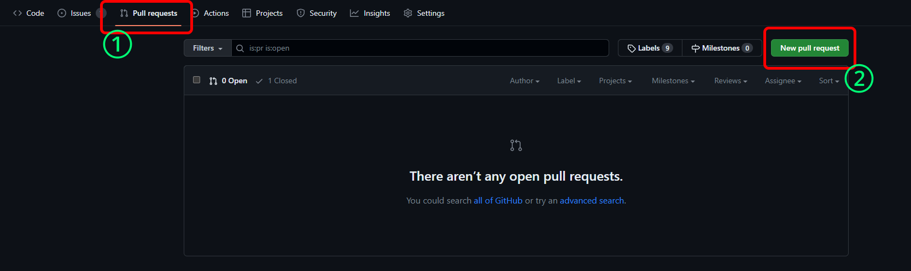
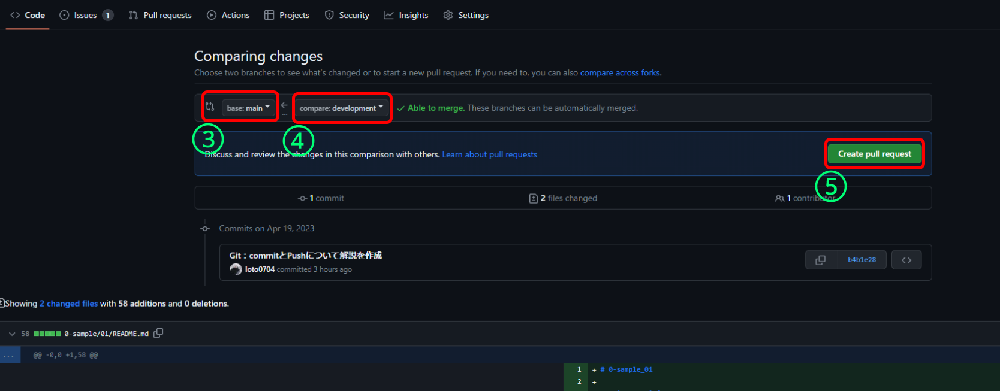
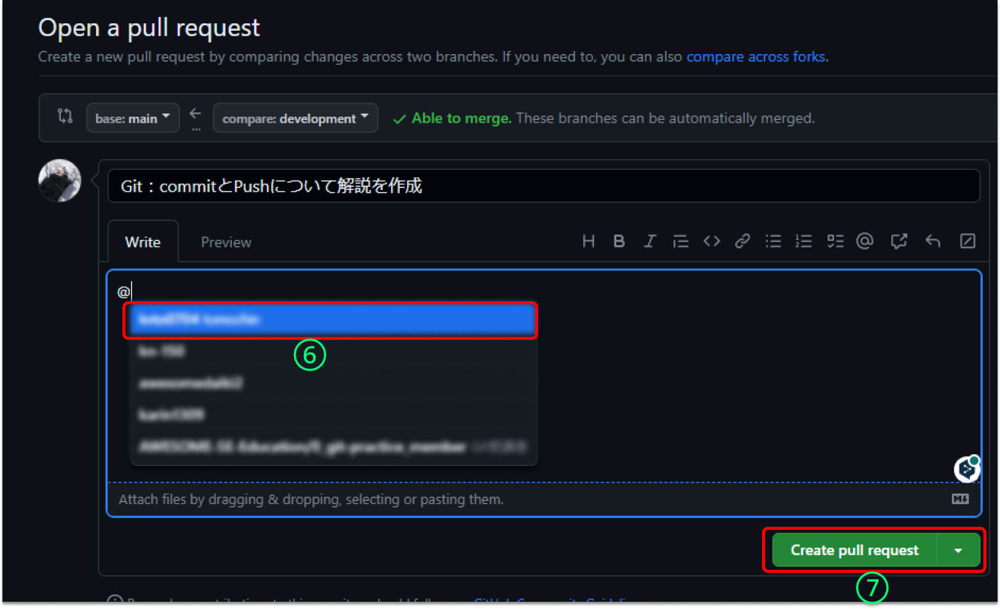
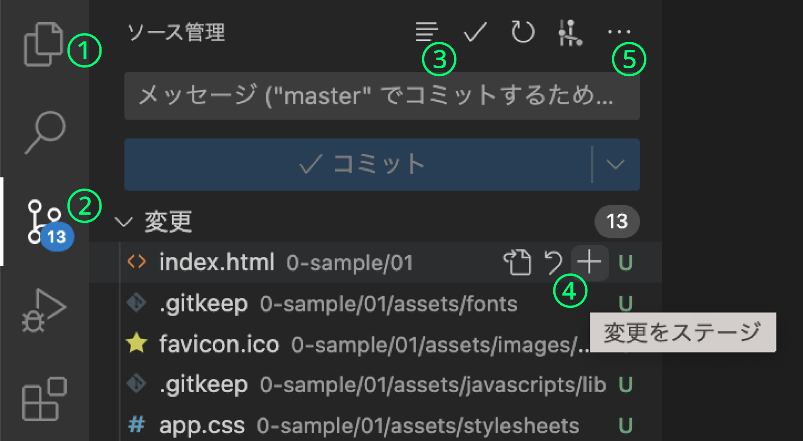

# 課題の提出方法について

## 提出の流れ
1. 本リポジトリを個人のアカウントへ**fork**
2. 本リポジトリのfork後、**clone**
3. 任意の名前で**ブランチ**を作成
4. 課題着手
5. 課題終了後、ブランチに**commit**・**push**で提出
6. （fork先ブランチからfork先mainブランチ）**Pull Request**する
7. Pull Requestしたurlをslackに添付して提出の報告
8. （レビュー&問題がなければ、レビュワーが**merge**する）

※fork元：このリポジトリ<br>
※fork先：個人アカウントのリポジトリ

## Git：commit、Push、Pull Request
**このカリキュラム**ではGitのcommit、Push、Pull Requestについて学びます。
これらはチーム開発を行う上で必要不可欠なGitのとてもよく使う機能です。
しかし、チームや案件先により、これらの運用方法が異なる場合があります。
したがって、ここでは**基本的な機能**や**これらのやり方**を説明します。
また本資料はエディターがVS Codeの前提で記載しております。
VS Code以外のエディターを使用の場合は適宜読み替えてください。
※VS Codeの画面については[VSCodeの画面解説](#VSCodeの画面解説)を参照

### commitについて
#### commitとは？
```
ファイルやディレクトリの追加・変更を、リポジトリに記録するにはコミットという操作を行います。
コミットを実行すると、リポジトリの内では、前回コミットした時の状態から現在の状態までの差分を記録したコミット(またはリビジョン)と呼ばれるものが作成されます。
このコミットは、次の図のように時系列順につながった状態でリポジトリに格納されています。
このコミットを最新の物から辿ることで、過去の変更履歴やその内容を知ることができるようになっています。
```
引用：[Gitの基本：変更を記録するコミット（backlog）](https://backlog.com/ja/git-tutorial/intro/03/)

#### 実際にcommitしてみる
1. 追加・変更したファイルやディレクトリを`git add .`や`git add [変更ファイル]`でステージングする
2. 「ソース管理」タブを選択し、ステージングが確認できた場合、`git commit -m "メッセージ"`を行う

#### commitのメッセージ例
- 機能修正: 「ログイン機能の修正」 
- バグ修正: 「カートバグの修正」 
- 新機能追加: 「検索機能の追加」 
- ドキュメント更新: 「READMEの更新」

### Pushについて
#### Pushとは？
```
リモートリポジトリで自分の手元のローカルリポジトリの変更履歴を共有するには、ローカルリポジトリ内の変更履歴をアップロードする必要があります。
そのために、Gitではプッシュ(Push)という操作を行います。
Pushを実行すると、リモートリポジトリに自分の変更履歴がアップロードされて、リモートリポジトリ内の変更履歴がローカルリポジトリの変更履歴と同じ状態になります。
```
引用：[リポジトリの共有：リモートリポジトリにプッシュする（backlog）](https://backlog.com/ja/git-tutorial/intro/09/)

#### 実際にPushしてみる
#### デフォルトブランチの場合
1. `git push origin [デフォルトブランチ]`行う
   1. 通常デフォルトブランチは。「main」「master」「develop」であることが多い
2. リモートリポジトリへ行って、Pushができているか確認
#### ローカルブランチの場合
1. `git push origin [ローカルブランチ]`行う
2. リモートリポジトリへ行って、Pushができているか確認

### Pull Requestについて
#### Pull Requestとは？
```
開発者のローカルリポジトリでの変更を他の開発者に通知する機能です。

【プルリクエスト機能】
- 機能追加や改修など、作業内容をレビュー・マージ担当者やその他関係者に通知します。
- ソースコードの変更箇所をわかりやすく表示します。
- ソースコードに関するコミュニケーションの場を提供します。
```
引用：[プルリクエストとは？（backlog）](https://backlog.com/ja/git-tutorial/pull-request/01/)

#### 実際にPull Requestしてみる
**【今回の場合のPull Request先とPull Request元】**
- Pull Request先：mainブランチ
- Pull Request元：developmentブランチ

**【手順】**
1. Web上のGitHubページへ
2. **Pull Request**タブを選択
3. **New pull request**をクリック
4. Pull Request先を選択
5. Pull Request元を選択
6. **Create pull request**をクリック
7. プルリクエストコメントを記載
   1. メンション先（レビュアーを選択）
   2. 修正点等を記載
8. **Create pull request**をクリック
9. 完了

#### Pull Requestメッセージに記載内容
- 変更の目的: なぜこの変更が必要なのかを説明します。 
- 変更内容の概要: どのファイルがどのように変更されたかを示します。 
- テスト方法: どのように変更をテストしたか、またはテストする必要があるかを記述します。 
- 関連するIssueのリンク: 関連するIssueやチケットへのリンクを含めると、コンテキストの理解が容易になります。 
- その他の考慮事項 
  - レビュアーへの説明: 特に重要な変更点や注意すべき点をレビュアーに伝えます。 
  - コードの変更に対する理由: なぜ特定のアプローチを選んだのか、その理由を説明します。







## VSCodeの画面解説


1. **エクスプローラー**タブ
   1. フォルダーやファイルの選択、閲覧・修正を行うタブ
2. **ソース管理**タブ
   1. 簡易的なGitのGUI
3. ソース管理タブの**View切り替え**ボタン
   1. 「一覧として表示」や「ツリーとして表示」を切り替えを行う
4. **変更のステージ**ボタン（「+」マークボタン）
   1. commitするファイルを選択する機能
   2. ステージすることにより、この時点の変更がcommitされる
   3. ツリー表示の場合はフォルダーごとステージ可能
